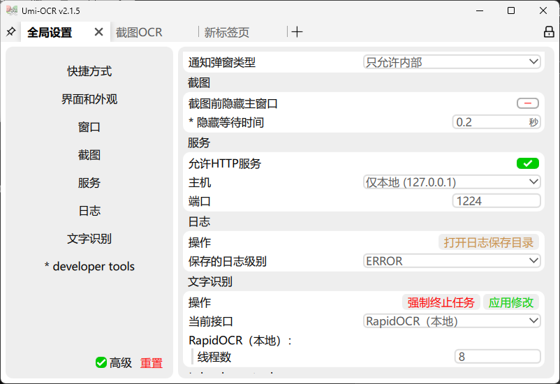

# SafeBotQQ

> **OCR + 模板匹配驱动的安全 QQ 机器人框架**  
> 完美适配 **OneBot v12** 协议，兼容部分 **OneBot v11** 接口。  
> 🛡️ 基于非侵入式图像识别技术，专为 Windows 环境设计。
>
> 💡 **定位说明**: 本项目旨在为现有的 OneBot 生态提供安全的视觉层支持。如果您需要**开箱即用、配置简单**且仅用于**自动回复**的完整解决方案，推荐使用 [QQPilot](#-相关项目推荐)。

## 📋 系统要求

- **操作系统**: Windows 8.1 及以上版本
- **运行环境**: Python 3.14 (需手动配置)
- **核心依赖**: 
  - Umi-OCR (需开启 HTTP 服务)
  - `Vimage.dll` & `InputEvent.dll` (源自 [QQPilot](https://github.com/Na2Cr2O7/QQPilot))

## 🚀 安装与部署

### 1. 环境准备
请确保已安装 **Python 3.14**。
> 🆚 **对比**: 不同于 QQPilot 的一键安装包，SafeBotQQ 需要用户手动配置 Python 环境，以便更灵活地集成到现有开发流中。

### 2. 安装依赖
在项目根目录执行：
```bash
pip install -r requirements.txt
```

### 3. 配置 Umi-OCR
本框架依赖 Umi-OCR 进行屏幕文字识别。
1. 下载并安装 [Umi-OCR](https://github.com/hiroi-sora/Umi-OCR)。
2. 在设置中开启 **HTTP 服务** 端口。
   

### 4. 配置文件
打开 `config.ini`，修改 `access_token` 及其他必要配置项。

### 5. 启动机器人

#### 🐢 标准启动（首次运行推荐）
首次运行需要遍历并收集联系人、群组等信息以建立本地索引。
> ⏱️ **预计耗时**：约 15 分钟（取决于好友和群组数量）。

```bash
python onebot.py
```

#### 🚀 快速启动（日常运行）
若已存在本地索引，可跳过信息收集步骤，实现秒级启动。
```bash
python onebot.py QuickStart
```

> 💡 **测试参考**: 具体的 API 调用示例请参考 `test.py`。

## 🔌 API 支持情况
OneBot v12 标准
| 接口方法 | 状态 | 备注 |
| :--- | :---: | :--- |
| 消息发送 | | |
| `send_private_msg` | ✅ 支持 | |
| `send_group_msg` | ✅ 支持 | |
| `send_message` | ✅ 支持 | 通用发送接口 |
| 消息获取 | | |
| `get_msg` | ✅ 支持 | |
| `delete_msg` | ❌ 不支持 | |
| 个人信息 | | |
| `get_self_info` | ✅ 支持 | |
| `get_user_info` | ⚠️ 部分支持 | 仅支持获取好友信息 |
| `get_friend_list` | ✅ 支持 | |
| 群组信息 | | |
| `get_group_info` | ✅ 支持 | |
| `get_group_list` | ✅ 支持 | ⚠️ 见下方[技术说明](#-技术说明) |
| `get_group_member_list` | ✅ 支持 | |
| `get_group_member_info` | ❌ 不支持 | |
| `set_group_name` | ❌ 不支持 | |
| `leave_group` | ❌ 不支持 | |
| 其他 | | |
| `get_version` | ✅ 支持 | |
| `两级群组/文件接口` | ❌ 不支持 | |
OneBot v11 标准 (兼容层)
| 接口方法 | 状态 | 备注 |
| :--- | :---: | :--- |
| `send_like` | ✅ 支持 | |
| `get_version_info` | ✅ 支持 | |
| `send_msg` | ❌ 不支持 | 请使用 `send_message` |
| `get_forward_msg` | ❌ 不支持 | |
| 群组管理 | ❌ 全部不支持 | 含踢人、禁言、管理员设置等 |
| 请求处理 | ❌ 全部不支持 | 含好友/群聊申请处理 |
| 信息获取 | ⚠️ 重定向 | `get_friend_list` 等均重定向至 OB12 接口实现 |
| 资源/状态 | ❌ 全部不支持 | 含 Cookie、CSRF、录音、图片、缓存清理等 |
| `set_restart` | ❌ 不支持 | |


## ⚙️ 技术说明

| 接口方法 | 状态 | 备注 |
| :--- | :---: | :--- |
| `send_like` | ✅ 支持 | |
| `get_version_info` | ✅ 支持 | |
| `send_msg` | ❌ 不支持 | 请使用 `send_message` |
| `get_forward_msg` | ❌ 不支持 | |
| 群组管理 | ❌ 全部不支持 | 含踢人、禁言、管理员设置等 |
| 请求处理 | ❌ 全部不支持 | 含好友/群聊申请处理 |
| 信息获取 | ⚠️ 重定向 | `get_friend_list` 等均重定向至 OB12 接口实现 |
| 资源/状态 | ❌ 全部不支持 | 含 Cookie、CSRF、录音、图片、缓存清理等 |
| `set_restart` | ❌ 不支持 | |


## 🤝 相关项目推荐

### 🌟 QQPilot
如果您觉得 SafeBotQQ 的配置过程较为繁琐，或者您不需要 OneBot 协议兼容性，仅需要一个**功能简单、覆盖最常用场景、开箱即用**的 QQ 机器人，那么 **[QQPilot](https://github.com/Na2Cr2O7/QQPilot)** 可能是更好的选择。

| 特性 | SafeBotQQ | QQPilot |
| :--- | :--- | :--- |
| **核心定位** | OneBot 协议适配器 (框架层) | 全自动回复机器人 (应用层) |
| **部署难度** | ⭐⭐⭐ (需配 Python/OCR/Config) | ⭐ (一键安装包，内置环境) |
| **协议标准** | ✅ 支持 OneBot v12/v11 | ❌ 私有协议，不兼容 OneBot |
| **功能范围** | 广 (支持消息收发、列表获取等 API) | 精 (专注于监控消息并自动回复) |
| **大模型集成** | 需自行在对接的框架中配置 | ✅ 内置 Ollama/API 配置向导 |
| **底层依赖** | 复用 QQPilot 的部分 DLL (`Vimage.dll`, `InputEvent.dll`) | 原生包含所有依赖 |

